| TabCode | MEI
------ | ------
Andeutung der Finger rechter ... 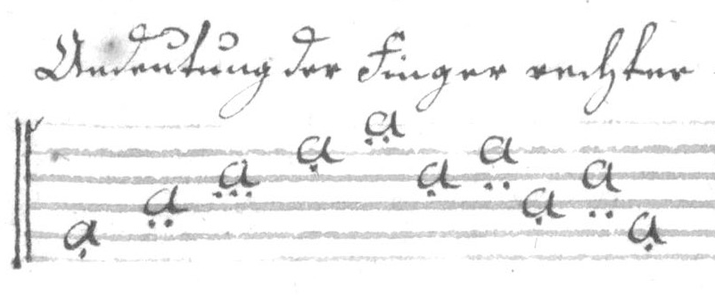 | `a5. a4: a1(Fr...:3) a2. a1: a3. a2: a4. a3: a5. ` | [MEI here]
... und linker Hand. 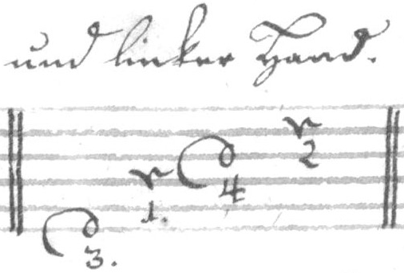 | `d6(Fl3:7) c4(Fl1:7) d3(Fl4:7) c2(Fl2:7)` | [MEI here]
Zugleich geschlagen. 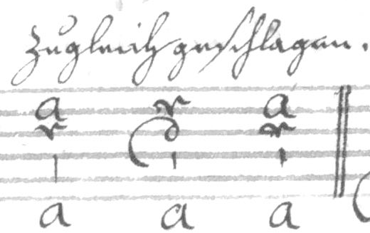 | `a2c3(E)Xa c2d3(E)Xa a2c3(E)Xa ` | [MEI here]
Gebrochen. 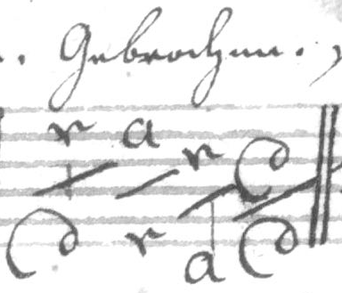 | `c2(S)d6 a2(S)c6 c3(S)Xa d3(S)d6` | [MEI here]
sincubirt.  |	`a2(S)c3(S)a6 a1(S)c2(S)a5 a2(S)c3(S)a6 c2(S)d3(S)d6`  | [MEI here]
Der Daumen Schlag. 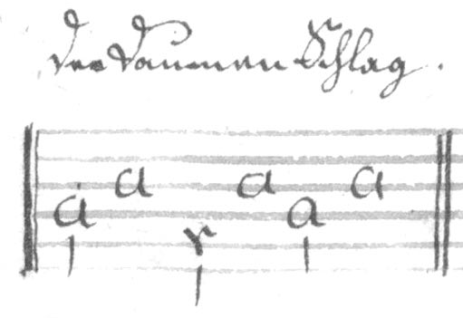 | `a4! a3 c5! a3 a4! a3 `  | [MEI here]
Gestossen. 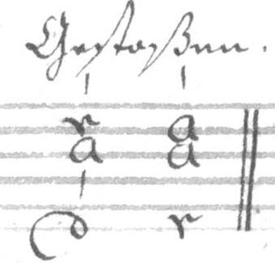 | `c2a3(E)d6 a2a3c6  {not in TabCode!}`  | [MEI here]
Ausgeschreine Abzug. 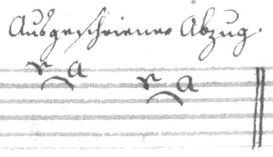 | `c1(C) a1 c2(C) a2`  | [MEI here]
Derselbe nicht aus geschreiben. 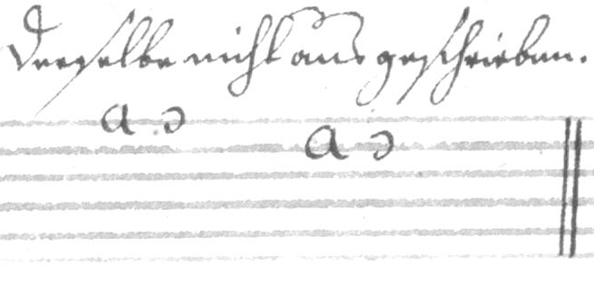 | `a1, a2,`  | [MEI here]
Doppelter Abzug 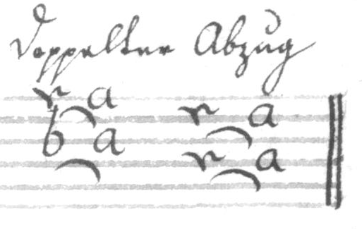 | `c1(C)c3(C) a1a3 c2(C)c4(C) a2a4`  | [MEI here]
Dopp. Abzug unausgeschreiben. 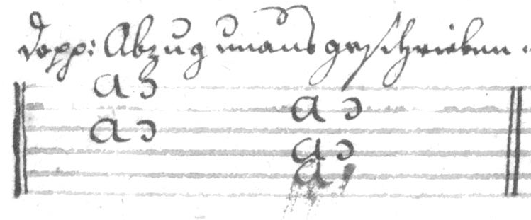 | `a1,a3, a2,a4, {a5 cancelled}`
Einfall. 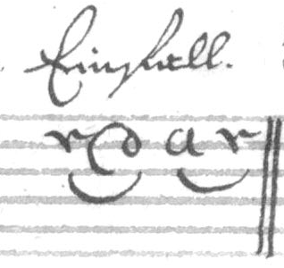 | `c2(C) d2 a2(C) c2`  | [MEI here]
Selbige unausgeschreiben. 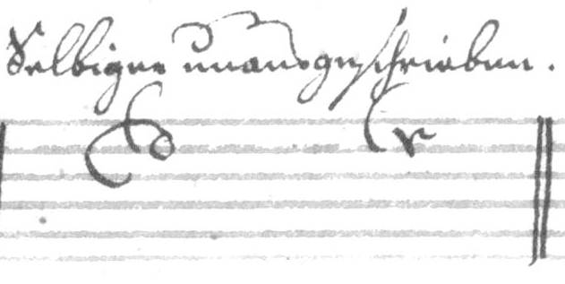 | `d2u c2u`  | [MEI here]
Doppelter Einfall. 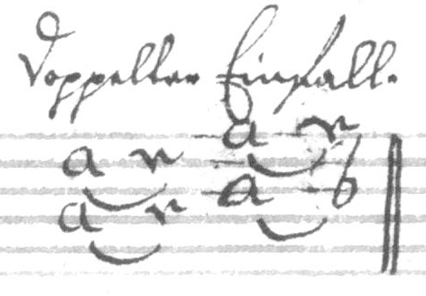 | `a2(S)a4(S) c2c4 a1(C)a3(C)c3 c1b3 `  | [MEI here]
oder [i.e. an alternative notation for Doppelter Einfall] 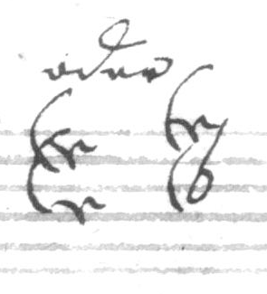 | `c2uc4u c1ub3u`  | [MEI here]
Beyderley Abzug. 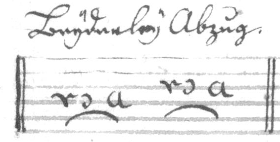 | `c4,(C) a4 c3,(C)a3 `  | [MEI here]
Einfall auf 3 Noten. 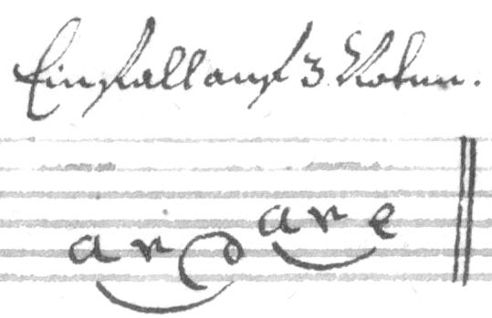 | 			`a5(C1:7) c5 d5(C-1:7) a4(C2:7) c4 e4(C-2:7) `  | [MEI here]
Dergleichen Abzug. 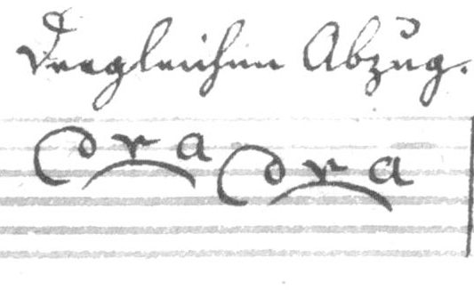 | `d2(C1:-7) c2 a2(C-1:7) d3(C2:-7) c3 a3(C-2:7)`  | [MEI here]
Bebung. 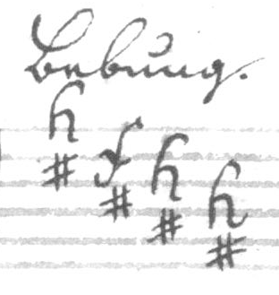 |  `h1# f2# h3# h4#`  | [MEI here]
Mordant. 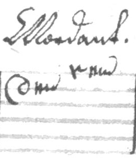 | `d2(Og:5) c1(Og:5)`  | [MEI here]
Semi-Mord: 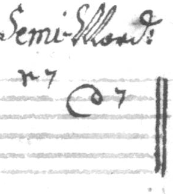 | `c1(Oi:5) d2(Oi:5)`  | [MEI here]
Scheifer. 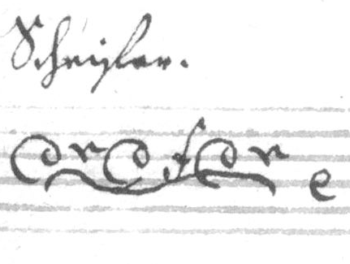 | `d3 c3 d3 f3 d3 c3 e4 {Not in TabCode!}`  | [MEI here]
Triller. 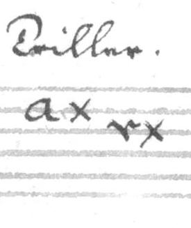 | `a2x c3x`  | [MEI here]
Semi-Trillo. 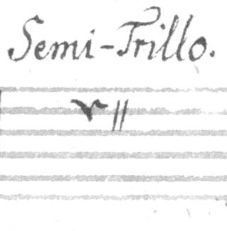 | `c2(Od:5)`  | [MEI here]
Doppelter Triller. 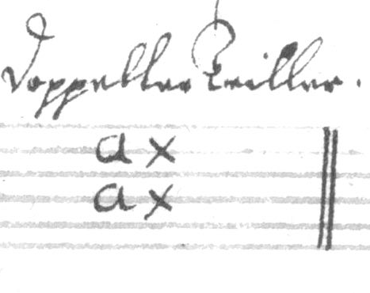 | `a2xa4x`  | [MEI here]
Fortgang des Trillers 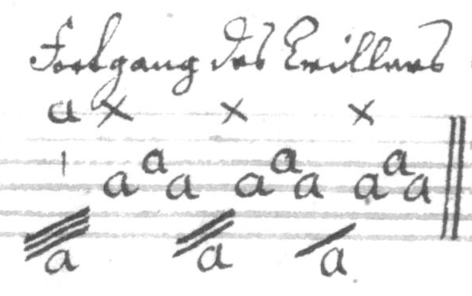 | `a1x(E)Xa/// a4 a3 a4 -1xXa// a4 a3 a4 -1xXa/ a4 a3 a4`  | [MEI here]  
Uberlegung 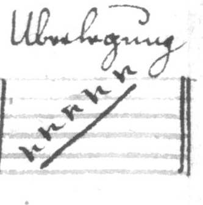 | `c5(C1:7) c4 c3 c2 c1(C-1:7) {Semantics for 'barré' lacking in TabCode!}`  | [MEI here]
oder. [i.e. an alternative notation for Uberlegung]  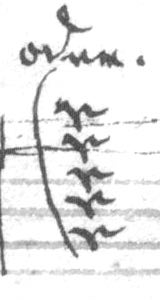 | `c1c2c3c4c5 {TabCode can't do this!} \`  | [MEI here]  
Bindung.  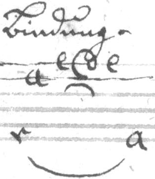 | `c6(C1:-7) a2 e1(C2:-67) d(C-2:7)1 e1 a6(C-1:-7)`  | [MEI here]
Gebrochener Baß 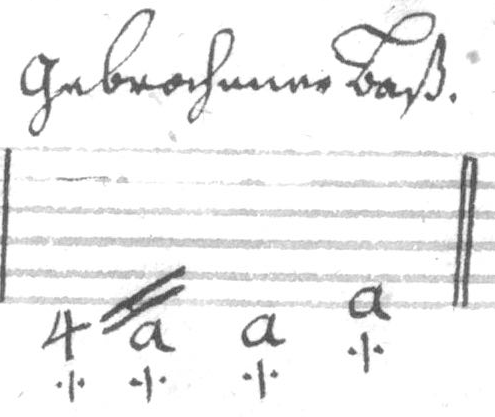 | `X4 Xa// Xa a6 {TabCode can't do this!}`  | [MEI here]
[?] Gestreichner Töne 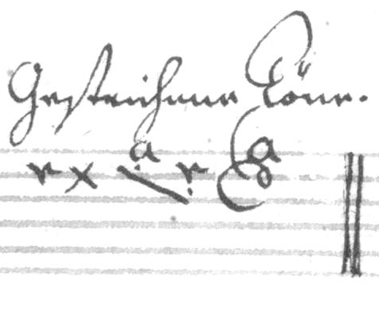 | `c2x a1.(C1:7) c2.(C-1:7) a1d2<`  | [MEI here]
Geschliefener Töne. 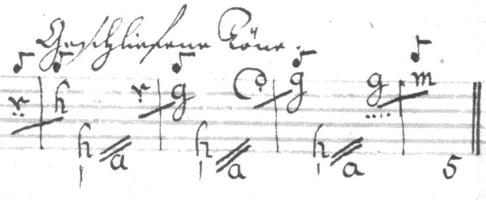 | `Ec3:(C1:7) \ Eh3(C-1:7) h6! Xa// c2.(C2:7) \ Eg2(C-2:7) h6! Xa// d1.(C3:7) \ Eg1(C-3:7) h6! Xa// g1(Fr3:7)(C4:7) \ Em1(C-4:7) X5 `  | [MEI here]
